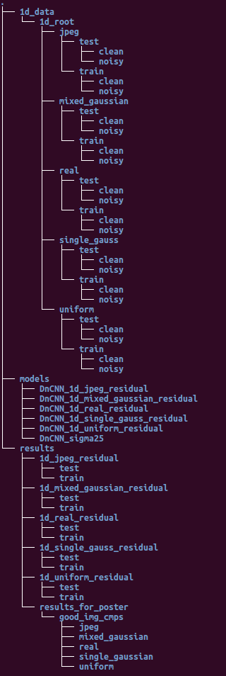

# Overviw

This group project is finished for an enrolled class Duke ECE588 - Image and Video Analysis. Based on the training framework and pytorch implementation of DnCNN by original author[https://github.com/cszn/DnCNN/tree/master/TrainingCodes/dncnn_pytorch], we generate different sorts of noise according to what we learned in the class and actively add noises into clean images(BSD68 dataset) to form image pairs - clean and noisy.

## Dependence
```
pytorch 1.2.0
```


## Train
Take mixed_gaussian for example, the command line for runing the python script would be:
```
main_train.py --root 1d_data/1d_root/mixed_gaussian --save_dir models/DnCNN_1d_mixed_gaussian_residual --batch_size 128 --epoch 50 --lr 1e-3
```

## Test
Similary, take mixed_gaussian for example, the command line for runing the python script would be:
```
main_test.py --model_dir models/DnCNN_1d_mixed_gaussian_residual --model_name model_090.pth --set_dir 1d_data/1d_root/mixed_gaussian --save_result 1 --result_dir results/1d_mixed_gaussian_residual
```

## Results

Please refer to the finalized poster pdf and evaluated cases in the resulted directory.


